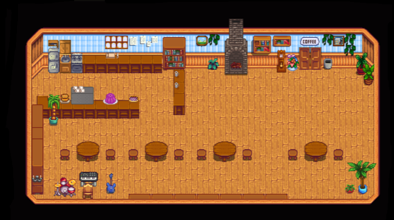
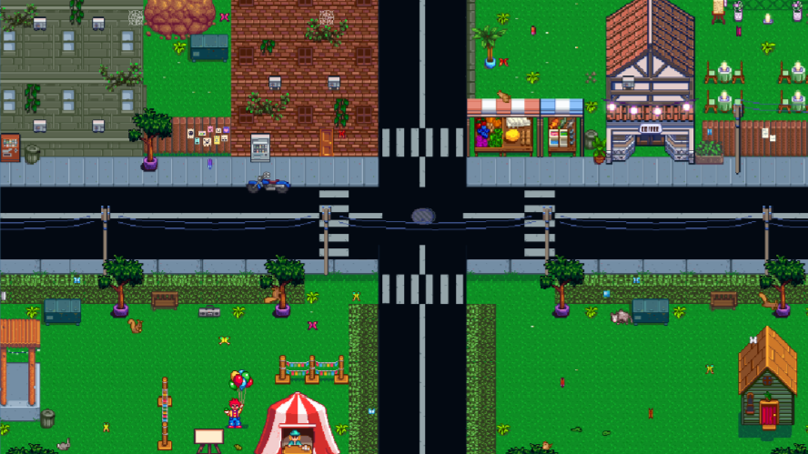
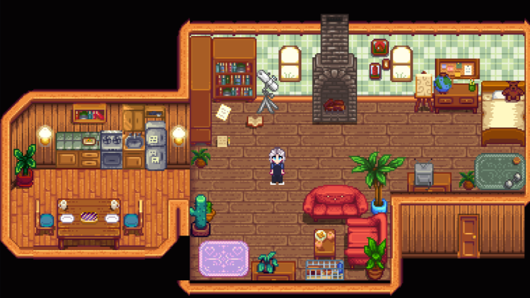

# ☕ Mystery Brew: A Coffee-Fueled Narrative Game

**Mystery Brew** is a narrative-driven mystery game set in a cozy café — with a dark twist.

You play as a new barista thrown into work unexpectedly after a long-time employee, Lucas, mysteriously vanishes. Over 5 in-game days, you'll master the art of coffee-making while unraveling the secrets behind his disappearance.

---

## 🎮 Gameplay Features

- 🧋 **Coffee Mechanics**  
  Craft espressos, lattes, cappuccinos, and more using realistic recipes and tools. Use the wrong portafilter? You’ll ruin the brew!

- 🕵️ **Interactive Storytelling**  
  Converse with regulars, observe their behavior, and gather clues through dialogue and discovery.

- 🔄 **Multiple Endings**  
  Your choices determine whether Lucas is saved, you get kidnapped, or the café fades into memory.

- 📖 **Rich Narrative**  
  Dive into a layered story exploring themes of obsession, secrecy, and human perception.

---

## 🧩 Core Mystery

Lucas didn’t just walk away — someone made sure he disappeared.

Listen closely.  
Watch carefully.  
Not everyone is who they seem.

Will you uncover the truth, or become the next victim?

---

### ☕ Café Interior

### 🗺️ Town

### 🏠 Home

---
## 🧃 Endings (Spoiler-Free)

- ☠️ Get kidnapped.
- ✅ Solve the mystery and bring Lucas back.
- ❌ Fail to uncover the truth and lose everything.

---

## 👥 Meet the Characters

- **Isabell** – The worried café manager.  
- **Pierce** – Too curious for comfort.  
- **Suzie** – An artist who sees more than faces.  
- **James** – A sharp-eyed cynic.  
- **Clara**, **Dante**, **Caroline** – Each holding a piece of the puzzle.

---

## 🎯 Why Play?

If you enjoy **story-rich games** with **light mechanics** and a **strong atmosphere**,  
_**Mystery Brew**_ is the perfect blend — think *Coffee Talk* meets *Her Story*.

---

## 🔧 Status

> ⚠️ **This game is currently in development.**  
> Some features may not work as intended while debugging is ongoing.

📦 *Prototype / Demo *  
💡 Built for narrative testing, dialogue pacing, and interactive branching design.

---

> “Coffee only for the chosen.”
